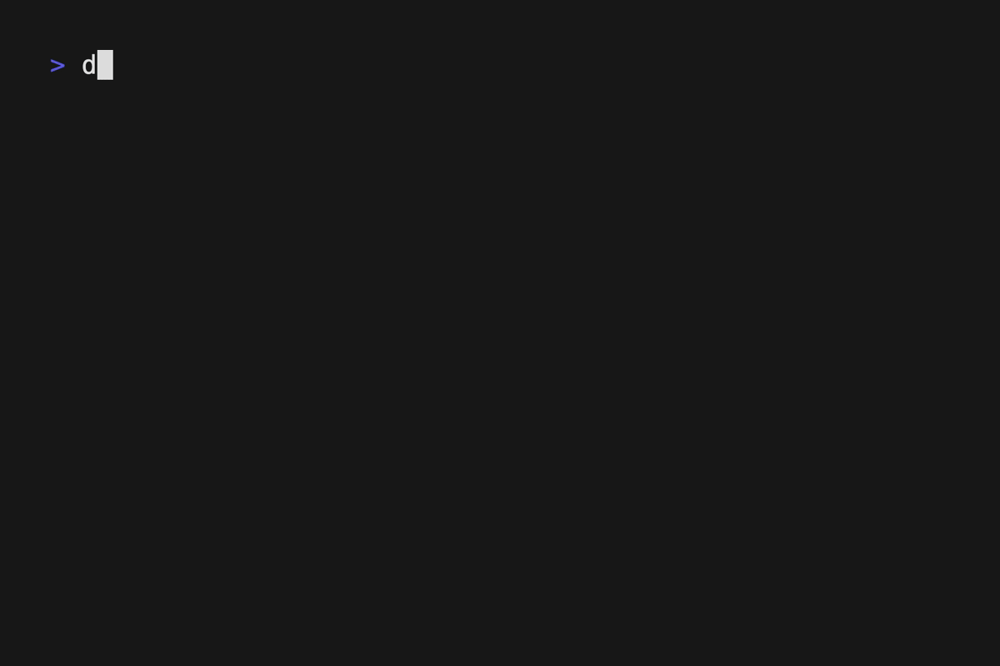

# DayLog

Keep track of what you're doing when you do it and forget trying to write summaries at EOD. DayLog[^1] is a dead-simple tool for terminal enthusiasts for taking quick notes throughout your day. It helps you quickly edit date-stamped markdown files where you can take notes about what you're doing, or leave a note in tomorrow's log for your future self.



## Usage

To write or edit today's file, run `daylog` and today's log will be opened in `$EDITOR`.

To view today's file, run `daylog show`.

To interact with a past or future log supply a date (`daylog show -- 2023/01/07`), or a more casual realtive reference, "tomorrow", "yesterday", "1 day ago", etc.

### Log storage

Logs are stored in `$XDG_DATA_HOME/daylog`. Use `daylog info` to print the exact directory.

## Installation

### Install a prebuilt binary

Via Homebrew,

```
brew tap notnmeyer/daylog-cli
brew install daylog
```

Or grab a release directly from the [releases page]()

### From source

1. Build the project with, `go build -o ~/bin/daylog main.go`, substituting `~/bin/daylog` for a different path if you prefer.

[^1]: DayLog ah ahh ahhhhhh, fighter of the night log ah ahh ahhhhh.

    

    DayyyyyyyyyyLLooooooooog!
    
    

If you're building on Linux, you may need to install X11 headers. Depending on your distro that could be `libx11-dev` (Debian/Ubuntu), `libx11-devel` (Fedora/RHEL/CentOS), or `libx11` (arch).
