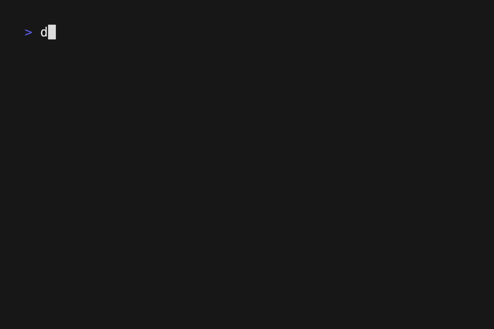

# DayLog

Keep track of what you're doing when you do it and forget trying to write summaries at EOD. DayLog[^1] is a dead-simple tool for terminal enthusiasts for taking quick notes throughout your day. It helps you quickly edit date-stamped markdown files where you can take notes about what you're doing, or leave a note in tomorrow's log for your future self.



## Installation

### Homebrew
```
brew tap notnmeyer/daylog-cli
brew install daylog
```

### Releases
Grab a release directly from the [releases page]()

### From source
`go build -o ~/bin/daylog main.go`, substituting `~/bin/daylog` for a different path if you prefer.

## Usage

To write or edit today's log, run `daylog` and today's log will be opened in `$EDITOR`.

To view today's log, run `daylog show`.

To interact with a past or future log supply a date (`daylog show -- 2023/01/07`), or a more casual realtive reference, "tomorrow", "yesterday", "1 day ago", etc.

You can append a quick one-line entry without opening an editor with `-a`/`--append`, `daylog -a "ate a burrito"` (this appends `- ate a burrito` to today's log). It accepts the usual date references too, `daylog -a "ate a burrito" -- yesterday`.

You can pipe updates as well, `echo "- ate a burrito" | daylog`.

For other commands and options see, `daylog --help`.

### Interactive TUI (experimental)

`daylog tui` opens an interactive terminal UI for browsing and editing your logs. It lands on a ledger of every day, newest first, with a preview of each. From there you can:

- `↑`/`↓` move, `enter` to open a day
- `a` append a one-line entry, `e` open the day in `$EDITOR`, `c` copy the log (works from the day list too)
- `/` filter by date or text (searches log contents), `n` start a new day from a date
- `t` toggle todos, `p` switch projects, `?` for full help, `q` to quit

Add `-p <project>` to open a specific project.

### Log storage

Logs are stored in `$XDG_DATA_HOME/daylog`. Use `daylog info` to print the exact directory.

---

[^1]: DayLog ah ahh ahhhhhh, fighter of the night log ah ahh ahhhhh.

    

    DayyyyyyyyyyLLooooooooog!
    
    
